# Git and Open Source

The first step for any good developer is setting up an environment to write and backup code. We'll be covering the basics of Git (a version control system designed to manage code), some of the available service providers, and how you can use this to build a foundation for good coding habits.

As a practical demonstration, we will also be making a small open source contribution!

---

## Recommended Resources / Links

### Git Service Providers

[GitHub](https://github.com)

[GitLab](https://gitlab.com)

[Bitbucket](https://bitbucket.org)

### Git Clients

[Sourcetree](https://www.sourcetreeapp.com/)

[GitKraken](https://www.gitkraken.com/)

### Useful Resources

[GitHub Student Pack](https://education.github.com/pack)

[GitLab Education Pack](https://about.gitlab.com/education/)

[Atlassian Git Cheatsheet](https://www.atlassian.com/git/tutorials/atlassian-git-cheatsheet)

[Atlassian Git Tutorial](https://www.atlassian.com/git/tutorials)

[Git Documentation](https://git-scm.com/doc)

### I made a mistake!

[Git Flight Rules](https://github.com/k88hudson/git-flight-rules)

[Oh shit, Git!](https://ohshitgit.com)

---

## Presentation Slides

Will be added after the presentation.

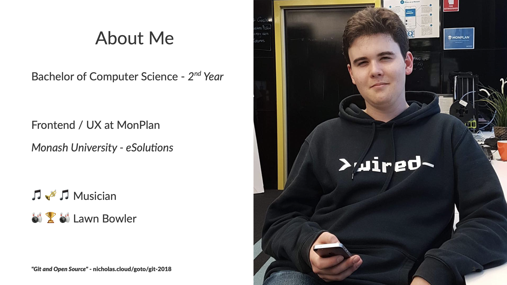

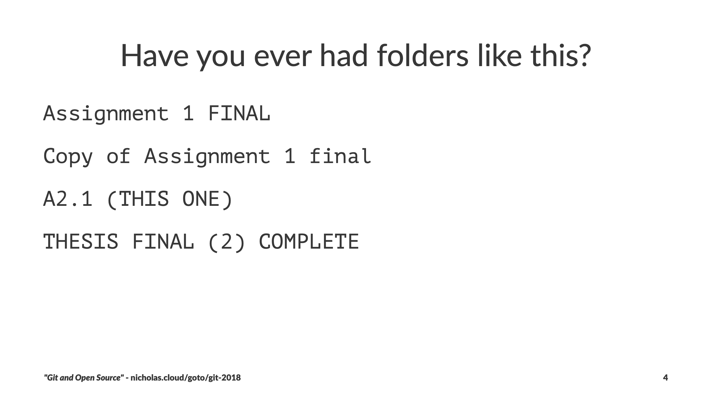
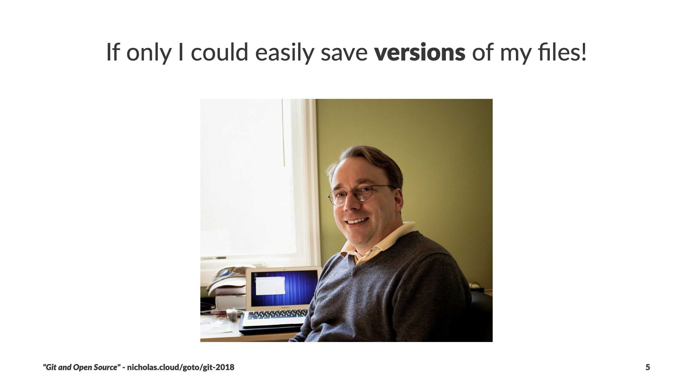

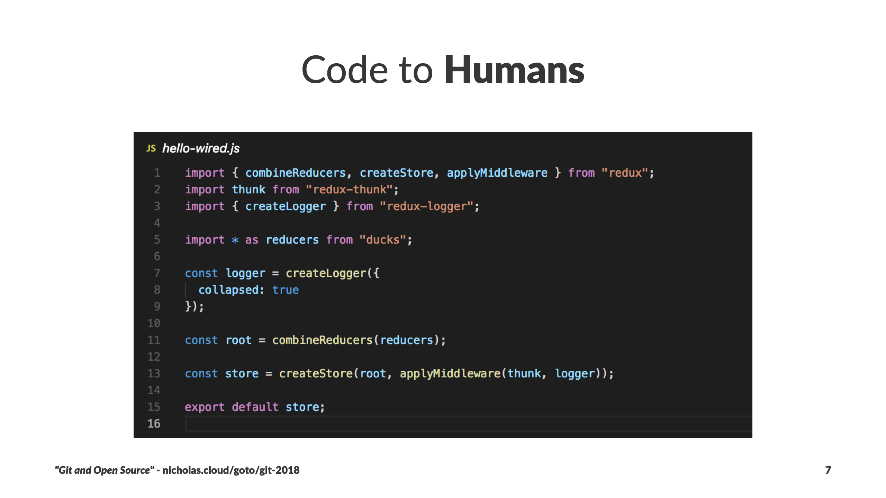
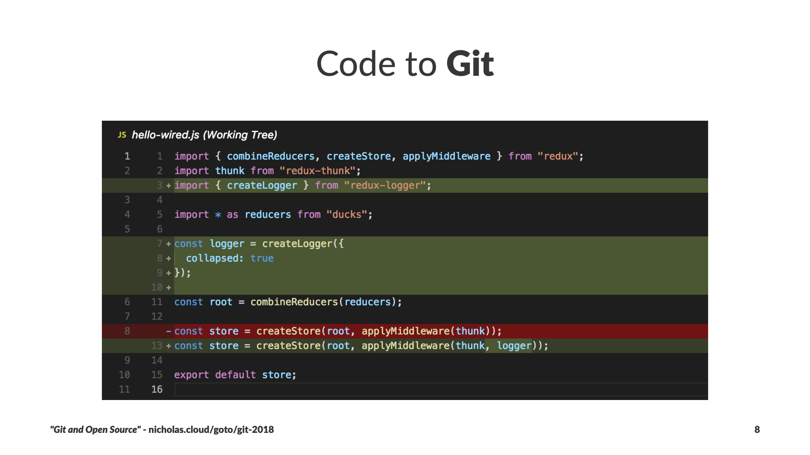
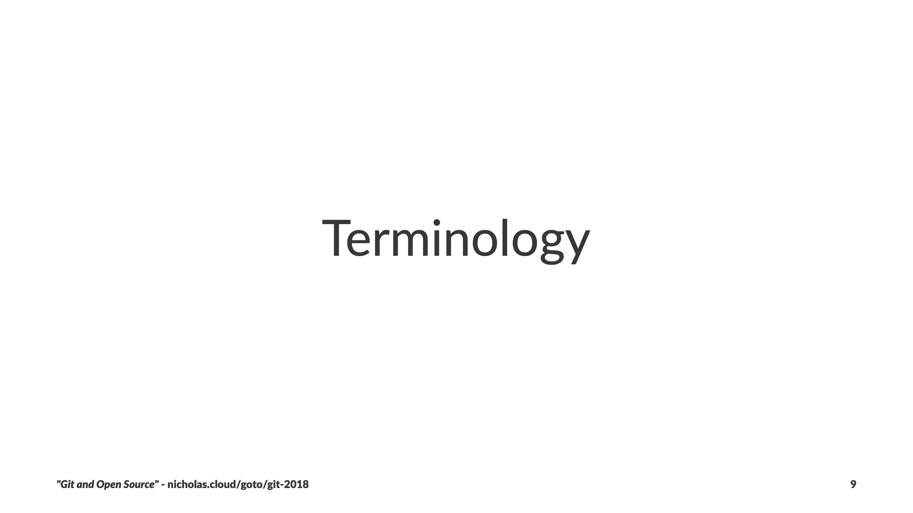

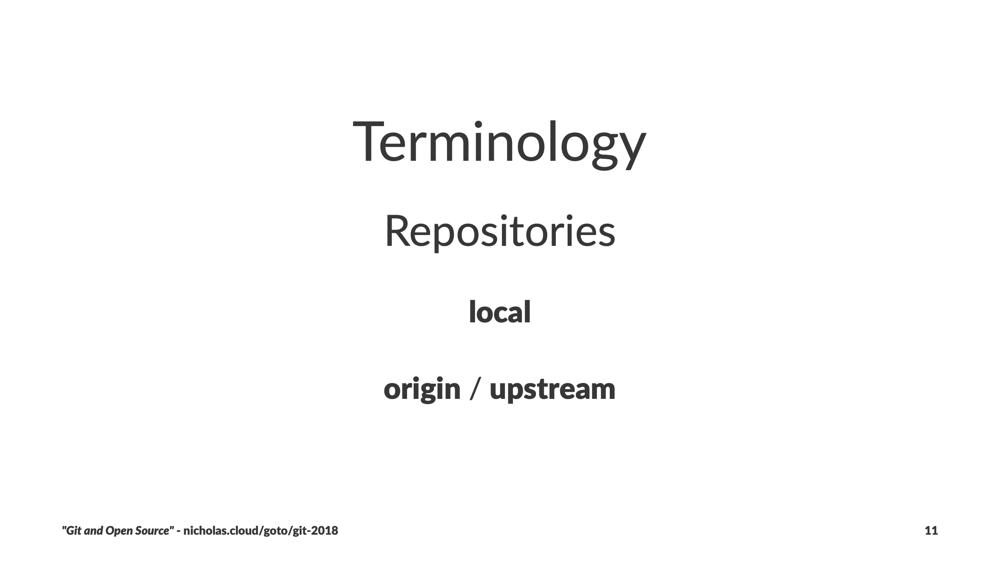
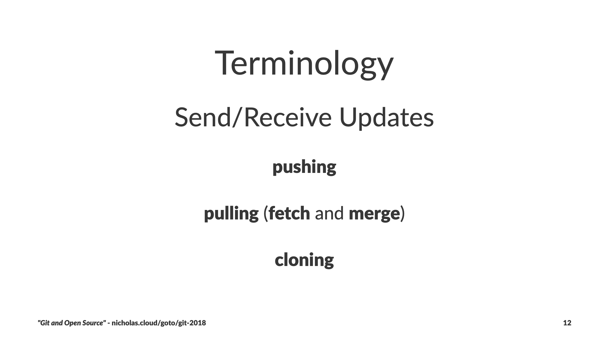

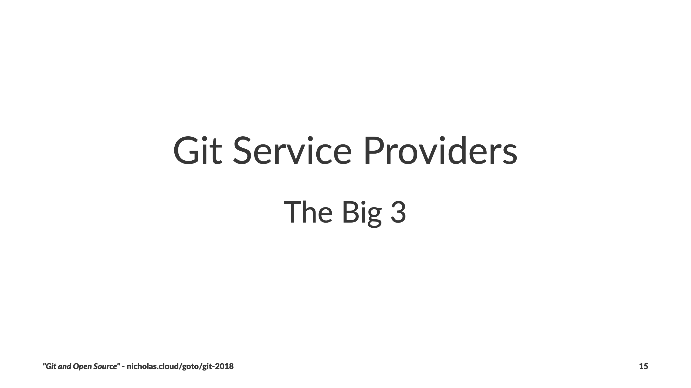
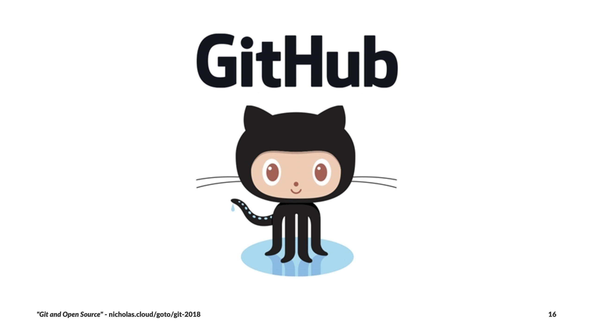

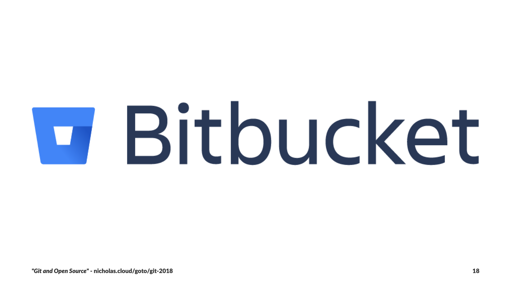
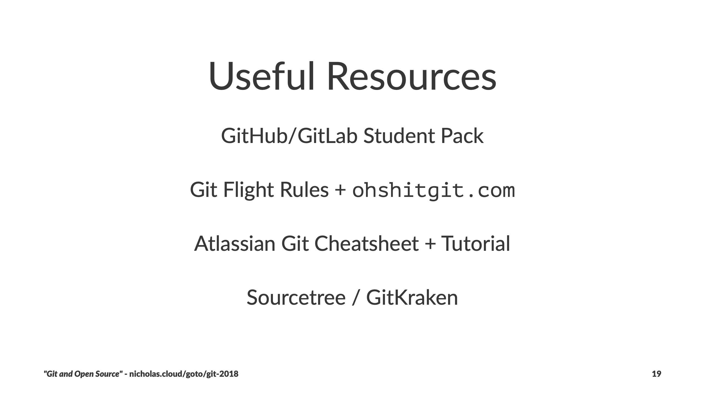

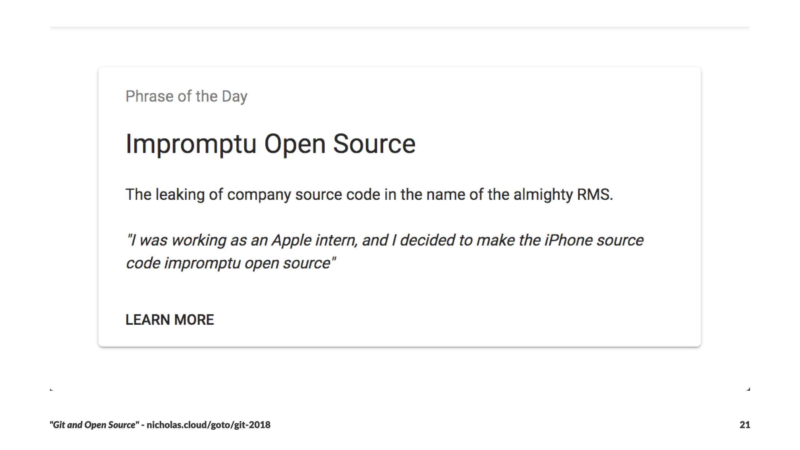
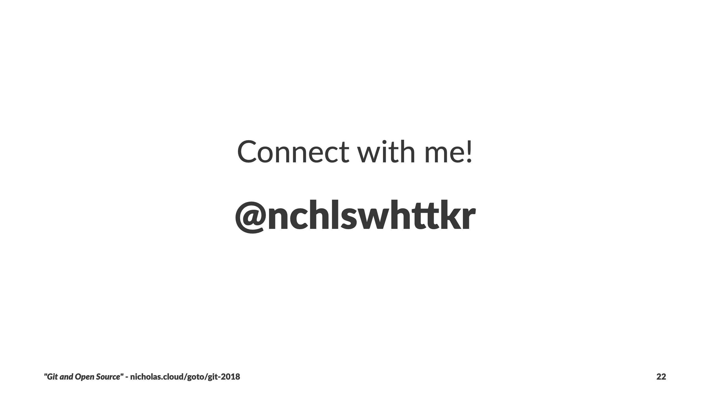
