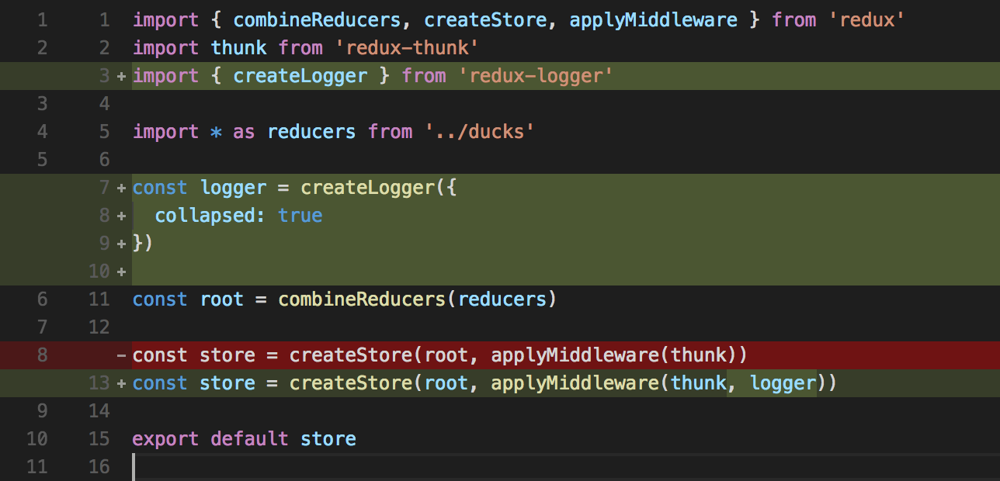

footer: **GIT AND OSS** | [github.com/nchlswhttkr/tech-talks](github.com/nchlswhttkr/tech-talks) 2018
slidenumbers: true

# Git and Open Source

## The fundamentals of version control

---

# Do you write code?

Where do you store your code?

- Cloud services (Dropbox, Google Drive, One Drive, iCloud)
- USB
- No backup...

---

# Have you ever had folders like this?

### `Assignment 1 FINAL`

### `Copy of Assignment 1 final`

### `A1 THIS ONE`

### `THESIS FINAL (2) COMPLETE`

---

## If only I could easily save **versions** of my files!

---

# Enter Git!

Code is a **collection** of changes over time

Like lego bricks, these changes form your codebase

^
observes incremental changes
timeline for code

---

# Code to **Humans**

---

# Code to **Git**

---

# Terminology

## Write + Save Code

## **staging**

^
updated/completed files are staged

## **commits**

^
collections of staged files are committed

---

# Terminology

## Repositories

## **local**

## **origin** / **upstream**

^
usually an external store

---

# Terminology

## Send/Receive Updates

## **pushing**

## **pulling** (**fetch** and **merge**)

^
pulls consist of two main steps
\- fetch updates
\- merge (apply) them

---

# Terminology

## Making Changes

## **branches**

## **forks**

---

# (Demo Time!)

---

# GitHub

^
social coding
largest community

---

# GitLab

^
open core
build pipeline support

---

# Bitbucket

^
atlassian suite integration
build pipeline support

---

# While you wait...

### `git push --force`

### Merge Conflicts

---

# GitHub Student Pack

# GitLab Education Pack

---

# Happy Coding!
