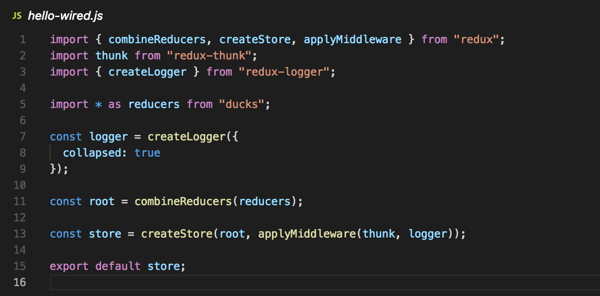
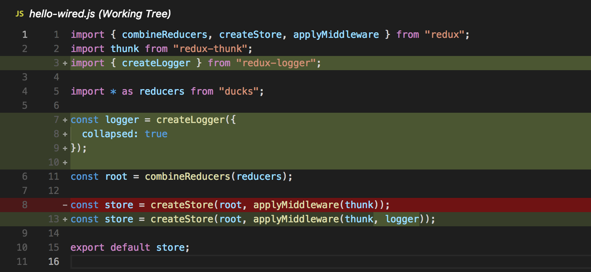
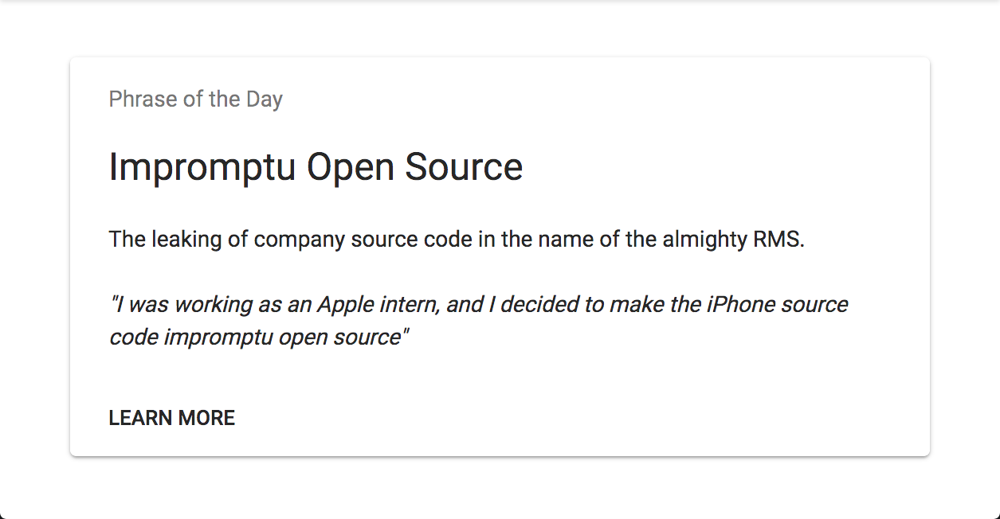

footer: [github.com/nchlswhttkr/tech-talks/git](github.com/nchlswhttkr/tech-talks) | 2018
slidenumbers: true

# [fit] Git and Open Source

## The fundamentals of version control

---

# About Me

Bachelor of Computer Science - _2nd Year_

 

Frontend / UX at MonPlan

_Monash University - eSolutions_

 

:musical_note: :trumpet: :musical_note: Musician

:bowling: :trophy: :bowling: Lawn Bowler

---

# Do you write code?

Where do you store your code?

- Cloud services (Dropbox, Google Drive, One Drive, iCloud)
- USB
- No backup...

---

# Have you ever had folders like this?

`Assignment 1 FINAL`

`Copy of Assignment 1 final`

`A2.1 (THIS ONE)`

`THESIS FINAL (2) COMPLETE`

---

## If only I could easily save **versions** of my files!

---

# Enter Git!

Code is a **collection** of changes over time

Like lego bricks, these changes form your codebase

^
observes incremental changes
timeline for code

---

# Code to **Humans**

^ we only see the **present** snapshot

---

# Code to **Git**

^ modified/added lines since **last** snapshot

---

# Terminology

---

# Terminology

## Write + Save Code

### **staging**

^ updated/completed files are staged

### **commits**

^ collections of staged files are committed

---

# Terminology

## Repositories

### **local**

### **origin** / **upstream**

^ usually an external store

---

# Terminology

## Send/Receive Updates

### **pushing**

### **pulling** (**fetch** and **merge**)

### **cloning**

^
pulls consist of two main steps
\- fetch updates
\- merge (apply) them

---

# Terminology

## Making Changes

### **branches**

### **forks**

---

# Demo Time!

---

# Git Service Providers

## The Big 3

---

^
social coding
largest community

---

^
open core
build pipeline support

---

^
atlassian suite integration
build pipeline support

---

# Useful Resources

### GitHub/GitLab Student Pack

### Git Flight Rules + `ohshitgit.com`

### Atlassian Git Cheatsheet + Tutorial

### Sourcetree / GitKraken

---

# Happy Coding!

## _Questions?_

#### _Get some stickers..._

---

---

## Connect with me!

# **@nchlswhttkr**
